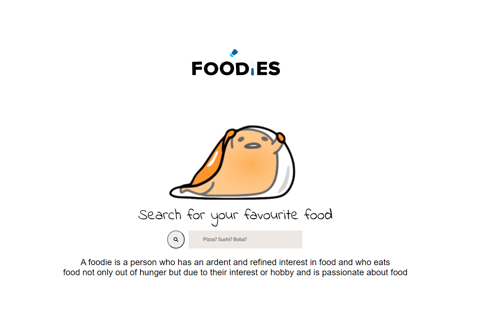

# Foodies

## Introduction:

Have you ever been to an unknown area looking for something to eat? Have you ever been hungry and have no idea what to eat? Well, welcome to Foodies! Here you'll never have to worry about not knowing what to eat ever again. Foodies finds your current location, takes the user input of what type of food they're craving, and returns a list of restaurants nearby! Go out there and explore new foods! 

* [Deployed Link](https://anniechen9025.github.io/Foodies/)
* [GitHub Repository](https://github.com/anniechen9025/Foodies)

## Summary:
1. When webpage loads, the user will be asked to either allow or block their location
2. Input a type of food into the search box
3. An image, list of 10 restaurants, and a map will be displayed based on user's location
4. The image and restaurant names, will link you to Yelps page
5. Yelp's page will display info such as phone number, directions, price, and more
6. Explore your options, pick a restaurant, and enjoy!

## Frameworks Used:
1. HTML
2. CSS
3. JavaScript
4. jQuery
5. Google Fonts
6. Yelp's API
7. Google Map's API
8. Geolocation's API

## Created by:
1. Jouan Chen
2. Christine Nguyen
3. Daniel Phan
4. Sandra de la Torre